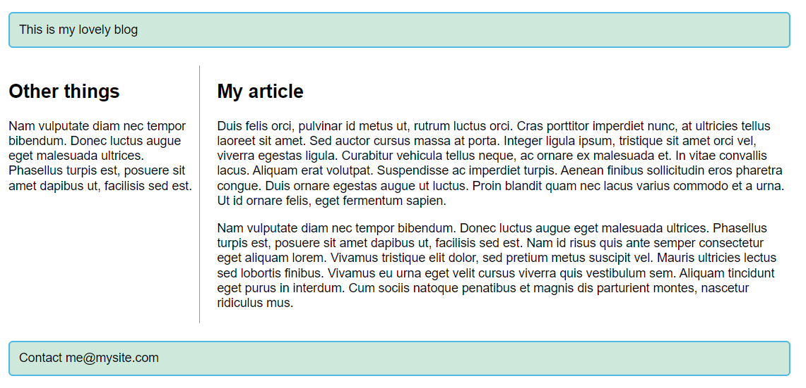

# **CSS-grids** 202210271103 <!-- omit in toc -->
> **e7856b**

- [Basics](#basics)
  - [setup](#setup)
  - [fractions](#fractions)
  - [gaps between tracks (gutters)](#gaps-between-tracks-gutters)
  - [repeat track listing](#repeat-track-listing)
  - [implicit vs explicit designation](#implicit-vs-explicit-designation)
  - [minmax() function](#minmax-function)
  - [as many columns as will fit](#as-many-columns-as-will-fit)
- [Line based placement](#line-based-placement)
- [Grid template areas](#grid-template-areas)
- [Grid framework in css grid](#grid-framework-in-css-grid)

## Basics

### setup
`display: grid;` will set the grid layout.
`grid-template-columns: 200px 200px 200px;` will make a 3 column grid.


### fractions
Add fractions to add flexibility to the grid layout.
```css
.container {
  display: grid;
  grid-template-columns: 1fr 1fr 1fr;
}
```


### gaps between tracks (gutters)

`gap` is shorthand for `column-gap` and `row-gap`

```css
.container {
  display: grid;
  grid-template-columns: 2fr 1fr 1fr;
  gap: 20px;
}
```


### repeat track listing

```css
.container {
  display: grid;
  grid-template-columns: repeat(3, 1fr);
  gap: 20px;
}
```

### implicit vs explicit designation

If you wish to give implicit grid tracks a size, you can use the grid-auto-rows and grid-auto-columns properties. If you add grid-auto-rows with a value of 100px to your CSS, you'll see that those created rows are now 100 pixels tall.

```css
.container {
  display: grid;
  grid-template-columns: repeat(3, 1fr);
  grid-auto-rows: 100px;
  gap: 20px;
}
```


### minmax() function
The minmax() function lets us set a minimum and maximum size for a track, for example, minmax(100px, auto). The minimum size is 100 pixels, but the maximum is auto, which will expand to accommodate more content.
```css
.container {
  display: grid;
  grid-template-columns: repeat(3, 1fr);
  grid-auto-rows: minmax(100px, auto);
  gap: 20px;
}
```


### as many columns as will fit
```css
.container {
  display: grid;
  grid-template-columns: repeat(auto-fill, minmax(200px, 1fr));
  grid-auto-rows: minmax(100px, auto);
  gap: 20px;
}
```


## Line based placement
We can arrange things in accordance with these lines by specifying the start and end line. We do this using the following properties:

-   [`grid-column-start`](https://developer.mozilla.org/en-US/docs/Web/CSS/grid-column-start)
-   [`grid-column-end`](https://developer.mozilla.org/en-US/docs/Web/CSS/grid-column-end)
-   [`grid-row-start`](https://developer.mozilla.org/en-US/docs/Web/CSS/grid-row-start)
-   [`grid-row-end`](https://developer.mozilla.org/en-US/docs/Web/CSS/grid-row-end)

These properties can all have a line number as their value. You can also use the shorthand properties:

-   [`grid-column`](https://developer.mozilla.org/en-US/docs/Web/CSS/grid-column)
-   [`grid-row`](https://developer.mozilla.org/en-US/docs/Web/CSS/grid-row)

```css
body {
        width: 90%;
        max-width: 900px;
        margin: 2em auto;
        font: 0.9em/1.2 Arial, Helvetica, sans-serif;
      }

      .container {
        display: grid;
        grid-template-columns: 1fr 3fr;
        gap: 20px;
      }

      header,
      footer {
        border-radius: 5px;
        padding: 10px;
        background-color: rgb(207, 232, 220);
        border: 2px solid rgb(79, 185, 227);
      }

      aside {
        border-right: 1px solid #999;
      }
      header {
        grid-column: 1 / 3;
        grid-row: 1;
      }

      article {
        grid-column: 2;
        grid-row: 2;
      }

      aside {
        grid-column: 1;
        grid-row: 2;
      }

      footer {
        grid-column: 1 / 3;
        grid-row: 3;
      }
```



## Grid template areas
An alternative way to arrange items on your grid is to use the [`grid-template-areas`](https://developer.mozilla.org/en-US/docs/Web/CSS/grid-template-areas) property and give the various elements of your design a name.

```css
.container {
  display: grid;
  grid-template-areas:
    "header header"
    "sidebar content"
    "footer footer";
  grid-template-columns: 1fr 3fr;
  gap: 20px;
}

header {
  grid-area: header;
}

article {
  grid-area: content;
}

aside {
  grid-area: sidebar;
}

footer {
  grid-area: footer;
}

```

The rules for `grid-template-areas` are as follows:

-   You need to have every cell of the grid filled.
-   To span across two cells, repeat the name.
-   To leave a cell empty, use a `.` (period).
-   Areas must be rectangular — for example, you can't have an L-shaped area.
-   Areas can't be repeated in different locations.

## Grid framework in css grid

Positioning in a 12 columns grid

```css
body {
        width: 90%;
        max-width: 900px;
        margin: 2em auto;
        font: 0.9em/1.2 Arial, Helvetica, sans-serif;
      }

      .container {
        display: grid;
        grid-template-columns: repeat(12, minmax(0, 1fr));
        gap: 20px;
      }

      header,
      footer {
        border-radius: 5px;
        padding: 10px;
        background-color: rgb(207, 232, 220);
        border: 2px solid rgb(79, 185, 227);
      }

      aside {
        border-right: 1px solid #999;
      }
      header {
        grid-column: 1 / 13;
        grid-row: 1;
      }

      article {
        grid-column: 4 / 13;
        grid-row: 2;
      }

      aside {
        grid-column: 1 / 4;
        grid-row: 2;
      }

      footer {
        grid-column: 1 / 13;
        grid-row: 3;
      }
```

[Mozilla grid demo](https://youtu.be/KOvGeFUHAC0)  

