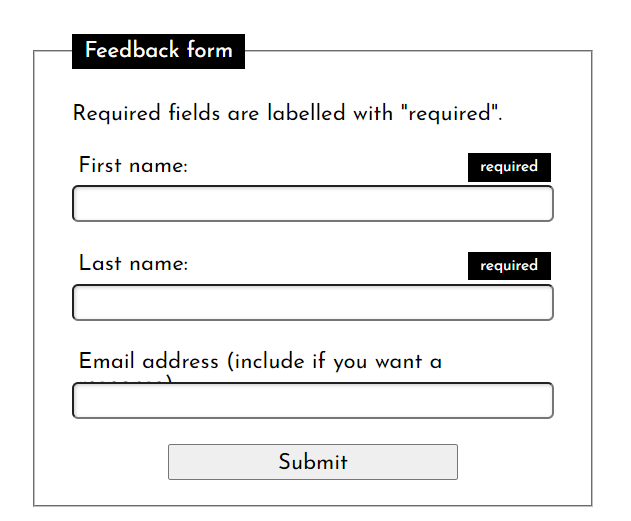

# **Css complex styling** 202210281439 <!-- omit in toc -->
> **415a67**

- [Styling Elements](#styling-elements)
  - [Styling checkboxes](#styling-checkboxes)
  - [styling radio boxes](#styling-radio-boxes)
  - [Toggle switch styling](#toggle-switch-styling)
- [Styling UI pseudo-classes](#styling-ui-pseudo-classes)
  - [required and optional](#required-and-optional)
  - [generated content](#generated-content)

## Styling Elements 

### Styling checkboxes

Reset browser styles:
```css

input[type="checkbox"] {
  appearance: none;
}
```

Apply custom style:
```css

input[type="checkbox"] {
  position: relative;
  width: 1em;
  height: 1em;
  border: 1px solid gray;
  /* Adjusts the position of the checkboxes on the text baseline */
  vertical-align: -2px;
  /* Set here so that Windows' High-Contrast Mode can override */
  color: green;
}

input[type="checkbox"]::before {
  content: "✔";
  position: absolute;
  font-size: 1.2em;
  right: -1px;
  top: -0.3em;
  visibility: hidden;
}

input[type="checkbox"]:checked::before {
  /* Use `visibility` instead of `display` to avoid recalculating layout */
  visibility: visible;
}

input[type="checkbox"]:disabled {
  border-color: black;
  background: #ddd;
  color: gray;
}
```


### styling radio boxes

```css


      input[type="radio"] {
        appearance: none;
      }

      input[type="radio"] {
        width: 20px;
        height: 20px;
        border-radius: 10px;
        border: 2px solid gray;
        /* Adjusts the position of the checkboxes on the text baseline */
        vertical-align: -2px;
        outline: none;
      }

      input[type="radio"]::before {
        display: block;
        content: " ";
        width: 10px;
        height: 10px;
        border-radius: 6px;
        background-color: red;
        font-size: 1.2em;
        transform: translate(3px, 3px) scale(0);
        transform-origin: center;
        transition: all 0.3s ease-in;
      }

      input[type="radio"]:checked::before {
        transform: translate(3px, 3px) scale(1);
        transition: all 0.3s cubic-bezier(0.25, 0.25, 0.56, 2);
      }
```


### Toggle switch styling

```css

<style>
      * {
        box-sizing: border-box;
      }

      /* Flexbox fu to make the control and label line up */

      li {
        width: 100px;
        display: flex;
        align-items: center;
        justify-content: space-around;
        position: relative;
      }

      /*
         Size the label, and make the on and off parts sit on top
         of one another using positioning
      */

      label {
        width: 20px;
        height: 20px;
        line-height: 20px;
        position: relative;
      }

      label span {
        position: absolute;
      }

      /*
         remove the default styling of the checkbox using appearance
         and create the outer toggle area
      */

      input[type="checkbox"] {
        -webkit-appearance: none;
        appearance: none;
        width: 44px;
        height: 24px;
        border-radius: 12px;
        border: 2px solid black;
        background: #eee;
        transition: all 0.4s;
      }

      /*
         style the ::before content to look like
         the inner toggle switch - the bit that moves
      */

      input[type="checkbox"]::before {
        width: 16px;
        height: 16px;
        border-radius: 9px;
        background-color: black;
        content: '';
        position: absolute;
        top: 7px;
        left: 16%;
        transition: all 0.4s;
      }

      /*
         change the outer background color and move the inner toggle switch
         when the checkbox is checked; use transitions for smooth animation
      */

      input[type="checkbox"]:checked {
        background-color: #ffaa00;
        transition: all 0.4s;
      }

      input[type="checkbox"]:checked::before {
        left: 35%;
        transition: all 0.4s;
      }

      /*
         cause the On and Off parts of the label to be visible when the checkbox is
         checked and unchecked, respectively
      */

      input[type="checkbox"] ~ label .on, input[type="checkbox"]:checked ~ label .off {
        opacity: 0;
      }

      input[type="checkbox"] ~ label .off, input[type="checkbox"]:checked ~ label .on {
        opacity: 1;
      }

      /*
         make the focus outline a bit more subtle on Chrome, rather than the
         default heavy blue outline
      */

      input:focus {
        outline: 1px dotted black;
      }

    </style>
```


## Styling UI pseudo-classes

### required and optional

```css

input:required {
  border: 1px solid black;
}

input:optional {
  border: 1px solid silver;
}
```

### generated content
The idea is that we can use the [`::before`](https://developer.mozilla.org/en-US/docs/Web/CSS/::before) and [`::after`](https://developer.mozilla.org/en-US/docs/Web/CSS/::after) pseudo-elements along with the [`content`](https://developer.mozilla.org/en-US/docs/Web/CSS/content) property to make a chunk of content appear before or after the affected element. The chunk of content is not added to the DOM, so it's invisible to screen readers; it is part of the document's styles.

```html

<div>
  <label for="fname">First name: </label>
  <input id="fname" name="fname" type="text" required />
  <span></span>
</div>
```

```css

fieldset > div {
  margin-bottom: 20px;
  display: flex;
  flex-flow: row wrap;
}

input + span {
  position: relative;
}

input:required + span::after {
  font-size: 0.7rem;
  position: absolute;
  content: "required";
  color: white;
  background-color: black;
  padding: 5px 10px;
  top: -26px;
  left: -70px;
}
```


