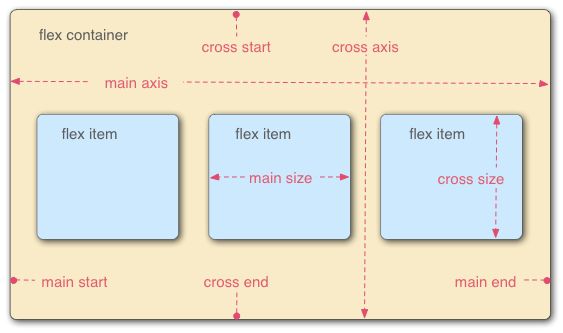

# **css-Flexbox** 202209292053 
> **2a30b5**

## basics
- To turn a container into a flexbox
  ```CSS
  display: flex;
  ```

- The `flex` shorthand
  ```css
    flex: 1;
    /* here flex is shorthand for flex: 1 1 0;
    * where 1 is flex-grow and
    * 1 is flex-shrink
    * 0 is flex-basis
    * flex-grow controls how much a flex item grows in comparaison to other flex items.
    * flex-shrink controls the speed at which the flex item will shrink.
     */
  ```
  [`flex`](https://developer.mozilla.org/en-US/docs/Web/CSS/flex) is a shorthand property that can specify up to three different values:

  -   The unitless proportion value we discussed above. This can be specified separately using the [`flex-grow`](https://developer.mozilla.org/en-US/docs/Web/CSS/flex-grow) longhand property.
  -   A second unitless proportion value, [`flex-shrink`](https://developer.mozilla.org/en-US/docs/Web/CSS/flex-shrink), which comes into play when the flex items are overflowing their container. This value specifies how much an item will shrink in order to prevent overflow. This is quite an advanced flexbox feature and we won't be covering it any further in this article.
  -   The minimum size value we discussed above. This can be specified separately using the [`flex-basis`](https://developer.mozilla.org/en-US/docs/Web/CSS/flex-basis) longhand value.

- Change direction of flow
  ```css
  flex-direction: row;
  /* flex-direction: column; is also available as well as row-reverse and column-reverse*/
  ```

  - Do flex items wrap or not:
  ```css
  flex-wrap: wrap;
  flex-wrap: nowrap;
  ```

  - Shorthand for flex flow:
  ```CSS
  flex-direction: row;
  flex-wrap: wrap;
  /* can be exhchanged for the shorthand */
  flex-flow: row wrap;
  ```
- Using `gap` to space items:
  ```css
  .container {
  height: 140px;
  padding: 16px;
  background: plum;
  border: 4px solid indigo;
  display: flex;
  align-items: center;
  justify-content: center;
  gap: 8px; 
  }
  ```
  ### flexbox model
  

### Horizontal and vertical alignment
[`align-items`](https://developer.mozilla.org/en-US/docs/Web/CSS/align-items) controls where the flex items sit on the cross axis.

-   By default, the value is `stretch`, which stretches all flex items to fill the parent in the direction of the cross axis. If the parent doesn't have a fixed height in the cross axis direction, then all flex items will become as tall as the tallest flex item. This is how our first example had columns of equal height by default.
-   The `center` value that we used in our above code causes the items to maintain their intrinsic dimensions, but be centered along the cross axis. This is why our current example's buttons are centered vertically.
-   You can also have values like `flex-start` and `flex-end`, which will align all items at the start and end of the cross axis respectively. See [`align-items`](https://developer.mozilla.org/en-US/docs/Web/CSS/align-items) for the full details.

You can override the [`align-items`](https://developer.mozilla.org/en-US/docs/Web/CSS/align-items) behavior for individual flex items by applying the [`align-self`](https://developer.mozilla.org/en-US/docs/Web/CSS/align-self) property to them.

[`justify-content`](https://developer.mozilla.org/en-US/docs/Web/CSS/justify-content) controls where the flex items sit on the main axis.

-   The default value is `flex-start`, which makes all the items sit at the start of the main axis.
-   You can use `flex-end` to make them sit at the end.
-   `center` is also a value for `justify-content`. It'll make the flex items sit in the center of the main axis.
-   The value we've used above, `space-around`, is useful — it distributes all the items evenly along the main axis with a bit of space left at either end.
-   There is another value, `space-between`, which is very similar to `space-around` except that it doesn't leave any space at either end.

### Ordering flex items
Flexbox also has a feature for changing the layout order of flex items without affecting the source order. This is another thing that is impossible to do with traditional layout methods.

```css

button:first-child {
  order: 1;
}
```
-   By default, all flex items have an [`order`](https://developer.mozilla.org/en-US/docs/Web/CSS/order) value of 0.
-   Flex items with higher specified order values will appear later in the display order than items with lower order values.
-   Flex items with the same order value will appear in their source order. So if you have four items whose order values have been set as 2, 1, 1, and 0 respectively, their display order would be 4th, 2nd, 3rd, then 1st.
-   The 3rd item appears after the 2nd because it has the same order value and is after it in the source order.

You can set negative order values to make items appear earlier than items whose value is 0.


  

