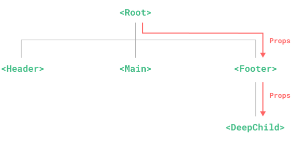
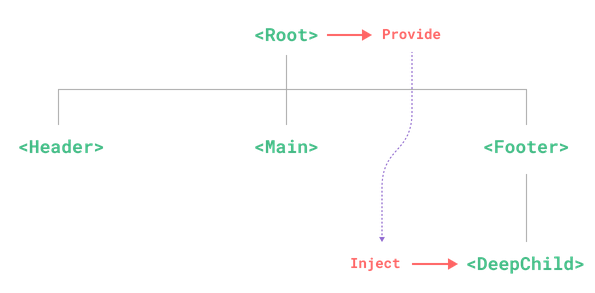

# **Vue-provide-inject** 202307211503 <!-- omit in toc -->
> **cd9089**

- [Provide and inject](#provide-and-inject)
  - [provide](#provide)
  - [App-level provide](#app-level-provide)
  - [inject](#inject)
  - [Working with Reactivity](#working-with-reactivity)

  

## Provide and inject

In order to pass data from parent to child, we need to use **provide** and **inject**. This mitigates the problems caused by *props digging*.

We can solve props drilling with provide and inject. A parent component can serve as a dependency provider for all its descendants. Any component in the descendant tree, regardless of how deep it is, can inject dependencies provided by components up in its parent chain.

> Prop Drilling


> Dependency injection


### provide
```javascript
<script setup>
import { provide } from 'vue'

provide(/* key */ 'message', /* value */ 'hello!')
</script>
```

### App-level provide
```javascript
import { createApp } from 'vue'

const app = createApp({})

app.provide(/* key */ 'message', /* value */ 'hello!')
```

### inject
```javascript
<script setup>
import { inject } from 'vue'

const message = inject('message')
</script>
```

### Working with Reactivity
When using reactive provide / inject values, it is recommended to keep any mutations to reactive state inside of the provider whenever possible. 

```javascript
<!-- inside provider component -->
<script setup>
import { provide, ref } from 'vue'

const location = ref('North Pole')

function updateLocation() {
  location.value = 'South Pole'
}

provide('location', {
  location,
  updateLocation
})
</script>
```

```javascript
<!-- in injector component -->
<script setup>
import { inject } from 'vue'

const { location, updateLocation } = inject('location')
</script>

<template>
  <button @click="updateLocation">{{ location }}</button>
</template>
```
