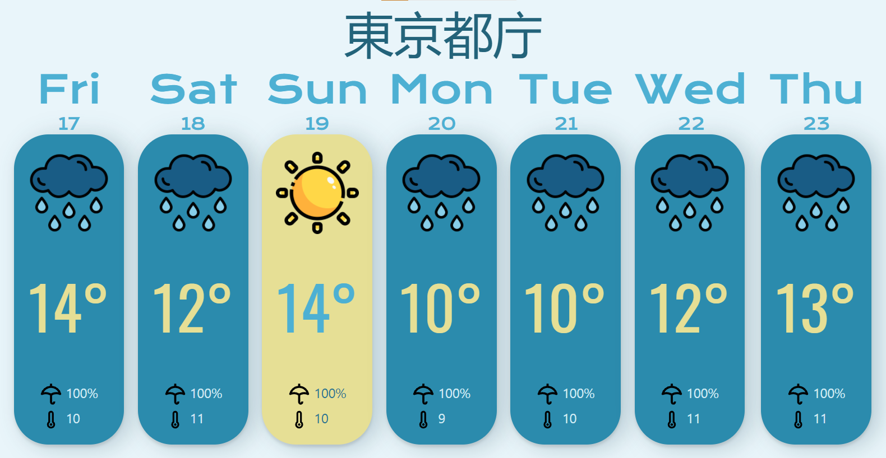

# Weather-app 202112151955 
> **4ec989**

# Challenge #8

[Advent of JavaScript](https://store.selfteach.me/courses/d2550633-b921-4971-8371-ff53ea196d05) / [Challenge #8](https://store.selfteach.me/courses/d2550633-b921-4971-8371-ff53ea196d05/1103550-challenge-8)

## **Brief**

In this project, we're creating a Weather App.    

  

## **Tasks**

- [x] Create component to hold a day  
  - [x] each day component will hold an image icon at the top, a degree variable in the center and precipitation and lowest degree variable at the bottom
  - [x] The day background color should reflect the day's weather
  - [x] create a list that holds the days component
- [x] Request data from weather api
- [x] Add date above the weather bar
- [x] use geolocation to fetch user location and then fetch weather data

## Working prototype

**Final product** - [Weather Application](https://voiceinthedark.github.io/React-Weather/)
**Github repo** - [Source](https://github.com/voiceinthedark/React-Weather)

## Roadmap
- [ ] Add a daily detailed view for when the user clicks over a day-bar.
- [ ] Make user input city name to see weather forecast for that city

  

