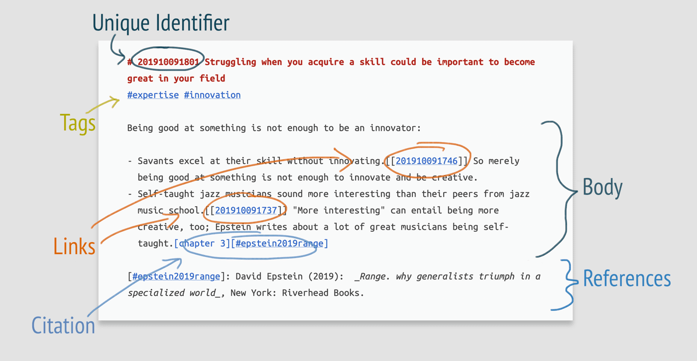
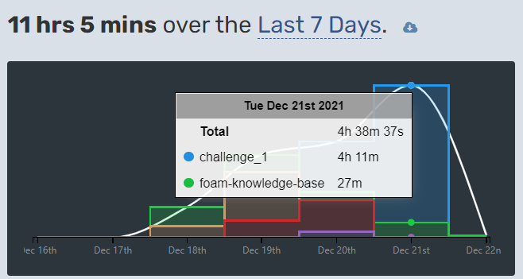

# Thoughts and ramblings <!-- omit in toc -->

- [Zettelkasten method](#zettelkasten-method)
- [solving create-react-app](#solving-create-react-app)
- [svg arc filling](#svg-arc-filling)
- [Electron react](#electron-react)
- [Capturing my active time](#capturing-my-active-time)
- [the problem with JS promises](#the-problem-with-js-promises)
- [Returning to Software Development](#returning-to-software-development)
- [Thinking like a programmer](#thinking-like-a-programmer)
- [MutationObserver](#mutationobserver)
- [Concepts of programming](#concepts-of-programming)

## Zettelkasten method

Incorporating the [zettelkasten](https://zettelkasten.de/introduction/) method into my note and problem solving methodology might improve my critical capability immensely.

> A zettlekasten template

>The true magic of a Zettelkasten, when compared to ordinary note-taking systems, comes from the heavy emphasis on connection. Each new Zettel needs to be placed in some relationship to another Zettel. [ZettelKasten-introduction][1]

## solving create-react-app

`npm uninstall -g create-react-app`

then ->

`npm install -g create-react-app`

## svg arc filling
How to decrease the filling of an [svg?][2]
[[Svg arc manipulation-202112231312]]

## Electron react
An electron react application? Code for web and have it automatically as a desktop application.
Looking into [Electron react boilerplate](https://electron-react-boilerplate.js.org/).
Speaking of which, learn webpack.

## Capturing my active time

## the problem with JS promises
How to return data from asynchronous promises?

## Returning to Software Development
Long Hiatus, Getting back through the [Odin project](https://www.theodinproject.com/).
Remastering javascript, html and css is obviously a mandatory must.

## Thinking like a programmer
[[Think Like a programmer-202210021023]]

## MutationObserver
I solved a problem I had using this library, need to refresh my memory about it.

## Concepts of programming

[How to think like a programmer](https://www.youtube.com/watch?v=azcrPFhaY9k)
- Think in algorithms and learn algorithms and design patterns
- 

[1]: <https://zettelkasten.de/introduction/#putting-the-pieces-together>
[2]: <https://css-tricks.com/how-to-create-an-animated-countdown-timer-with-html-css-and-javascript/>

[//begin]: # "Autogenerated link references for markdown compatibility"
[Svg arc manipulation-202112231312]: <javascript/Svg arc manipulation-202112231312> "Svg arc manipulation"
[Think Like a programmer-202210021023]: <reference/Think Like a programmer-202210021023> "Think Like a programmer"
[//end]: # "Autogenerated link references"