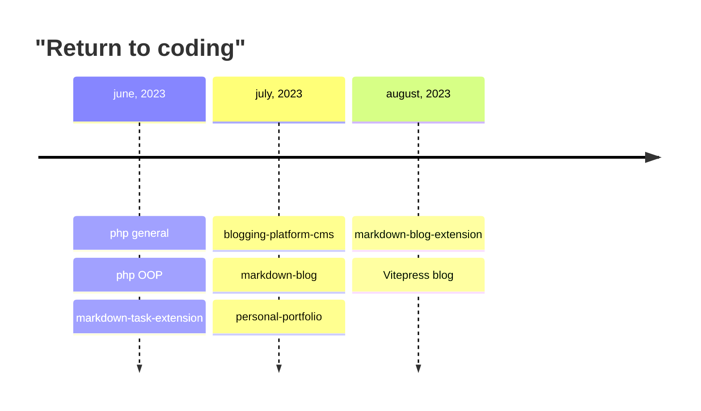

# Projects Timeline

#mermaid #timeline #coding

## Return to coding timeline

## Projects
### Blogging Platform [Repository](https://github.com/voiceinthedark/blogging-platform-cms)
- [[Blogging-platform-cms-202306232144]]
- [[Blogging-platform-tasks-202306250215]]

[//begin]: # "Autogenerated link references for markdown compatibility"
[Blogging-platform-cms-202306232144]: ../notes-development/projects/Blogging-platform-cms-202306232144 "Blogging-platform-cms"
[Blogging-platform-tasks-202306250215]: ../notes-development/projects/Blogging-platform-tasks-202306250215 "Blogging-platform-tasks"
[//end]: # "Autogenerated link references"